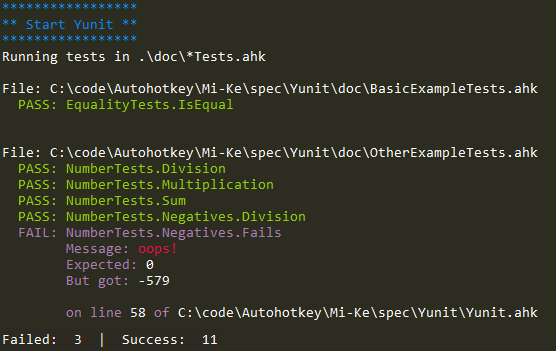

Yunit
=====
Super simple unit testing framework for [AutoHotkey](http://www.autohotkey.com/).


Basic Example
-------------

```ahk
#Include ..\Yunit.ahk
#Include ..\StdOut.ahk

Yunit.Use(YunitPorcelainStdOut).Test(EqualityTests, OtherTests)

class EqualityTests
{
    Begin()
    {
        ; Executes before each test
        this.expected := 123
    }

    IsEqual()
    {
        actual := 123
        Yunit.that(this.expected, actual, "extra fail msg")
    }

    End()
    {
        ; Executes after each test
        this.Delete("expected")
    }
}

; Nesting is possible:
class OtherTests
{
    class InnerTests
    {
    }
}
```

Running Tests
-------------

Run a testsuite:  
```ps1
cd doc
AutoHotkey.exe OtherExampleTests.ahk | more
```

Use the runner:  
```ps1
.\runner.ps1 -path .\doc -file "*Tests.ahk" -Monitor $false
```




Output Modules
--------------

Modules that come with Yunit:  
- `Stdout.ahk`: `YunitPorcelainStdOut` = Format understood by `runner.ps1`
- `JUnit.ahk`: `YunitJUnit` = JUnit Xml output
- `OutputDebug.ahk`: `YunitOutputDebug`
- `Stdout.ahk`: `YunitStdOut`
- `Window.ahk`: `YunitWindow` = Simple GUI

### Build your own

Stop running on first failed test:

```ahk
class EarlyExit
{
    Update(Category, Test, Result)
    {
        if IsObject(Result)
        {
            ExitApp 1
        }
    }
}
```

Usage: `Yunit.Use(YunitPorcelainStdOut, EarlyExit).Test(TestSuites)`


Docs
----
See [doc/Main.md](doc/Main.md)


Branch Description
------------------
- Branch *master* covers usage of YUnit in AutoHotkey from 1.1.x up to 2.0.a77
- Branch *v2* covers usage of Yunit in AutoHotkey from 2.0.a78 (where incompatible 
changes in GUI-interface where introduced)  

License
-------
Copyright 2012 Anthony Zhang (Uberi) and Joe Taber (infogulch).
